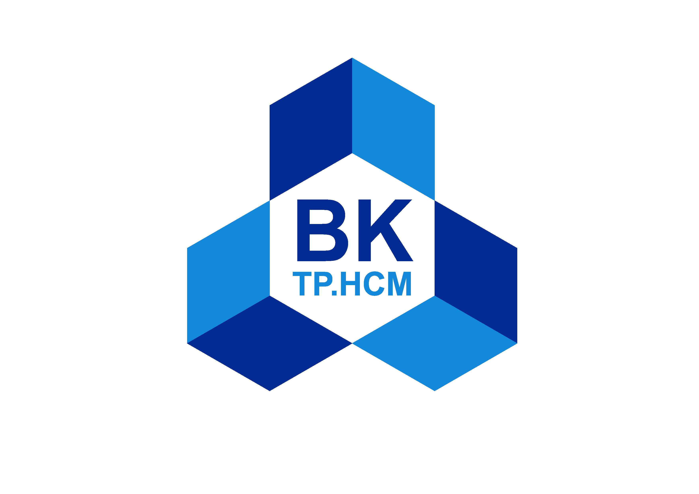

<!-- Futuristic GitHub Profile for Hiếu -->

<h1 align="center">🚀 Hiếu | HCMUT 🚀</h1>

  

  
  
  

---

  

---

## About Me

- Student at **Ho Chi Minh City University of Technology (HCMUT)**
- Passionate about AI and building futuristic solutions with cutting-edge technologies
- Always exploring the next big thing in tech

<!-- ## Skills

- Programming: Python, JavaScript, C++
- Cloud: AWS, Azure
- AI/ML: TensorFlow, PyTorch
- Security: Ethical Hacking, Penetration Testing

## Featured Projects

- **AI-powered Chatbot** – Next-gen conversational AI
- **Cyber Defense Platform** – Real-time threat detection
- **Cloud Automation Suite** – Automate everything -->

## 🌐 Connect with Me

  
  

---

  

<!-- End of Profile -->
